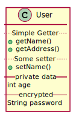

Title: PlantUML语言--类图
Date: 2014-12-19 19:17
Category: UML
Tags: PlantUML
Author: 阿七
Summary: 文本的UML语言PlantUML类图介绍

PlantUML 是纯文本的 UML 绘图工具,可以绘制:时序图、用例图、类图、组件图、活动图

纯文本的好处是可以用于版本控制,易修改,写的时候也不用考虑排版什么的.跟 Markdown 的哲学是一致的.

## 关系

类之间的关系通过下面的符号定义:
继承 (extension) `<|--`
合成 (composition) `*--`
聚合 (aggregation) `o--`

使用”..” 来代替”--” 可以得到点线. 


```ruby
@startuml
Class01 <|.. Class02:实现(Realization)
Class03 <|-- Class04:泛化(Generalization)
Class05 ..>  Class06:依赖(Dependency)
Class07 -->  Class08:关联(Association)
Class09 o--> Class10:聚合(Aggregation)
Class11 *--> Class12:组合(Composition)
@enduml
```
**实现**: 指的是对接口的实现
**泛化**: 指的是对基类的继承

依赖 关联 聚合 组合 表达了类之间的相关关系依次增强
**依赖**: 通常是一个类使用了另一个类,作为:方法的属性 局部变量 调用另一个类的静态方法
**关联**: 指的是一个类持有另一个类的引用,表示一个类知道另一个类,通常表达一种平级的关系
**聚合**: 表达了一个类包含另一个类,实现上和关联相同,只是层级不同
**组合**: 也是一个类包含另一个类,但是是一种强包含,当主体死亡,个体会被析构掉

## 可访问性
符号 | 可访问性
----|--------
`-` | private
`#` | protected
`̃` | package private
`+` | public


```ruby
@startuml
class Dummy { 
- field1 
# field2 
+ {static} field3
~ method1() 
+ method2()
# {abstract} method2()
} 
@enduml
```

可以看到plantuml使用图形替代了`+`,`-`
`skinparam classAttributeIconSize 0`可以停用这种替换

通过修饰符 `{static}` 或者 `{abstract}`,可以定义静态或者抽象的方法或者属性。

## 添加标题

```ruby
@startuml
class User {
.. Simple Getter .. 
+ getName()
+ getAddress()
.. Some setter ..
+ setName()
__ private data __ 
int age
-- encrypted -- 
String password
}
@enduml
```
## 抽象类和接口
用关键字`abstract` 或`abstract class` 来定义抽象类。抽象类用斜体显示。也可以使用 `interface`, `annotation` 和 `enum` 关键字。

```ruby
@startuml
abstract class AbstractList 
abstract AbstractCollection 
interface List
interface Collection

List <|-- AbstractList
Collection <|-- AbstractCollection
Collection <|- List 
AbstractCollection <|- AbstractList 
AbstractList <|-- ArrayList

class ArrayList { 
Object[] elementData size()
}

enum TimeUnit { 
DAYS
HOURS
MINUTES
}

annotation SuppressWarnings 

@enduml
```

## 包

```ruby
@startuml
package "Classic Collections" #DDDDDD { 
Object <|-- ArrayList
}

package net.sourceforge.plantuml { 
Object <|-- Demo1
Demo1 *- Demo2
}
@enduml
```
#### 参考资料
[官方中文文档](http://translate.plantuml.com/zh/PlantUML_Language_Reference_Guide_ZH.pdf)
[PlantUML —— 应用于 Eclipse 的简单快速的 UML 编辑软件](http://www.ibm.com/developerworks/cn/opensource/os-cn-ecl-plantuml/)
[PlantUML Extension for Python-Markdown](https://github.com/mikitex70/plantuml-markdown)
#### 在线生成UML图
[http://www.planttext.com/planttext](http://www.planttext.com/planttext)

##
记一下:
```python
import site;print site.getsitepackages()
```
可以看Python安装的库都装到哪去了
在我的机器上是
```python
['/System/Library/Frameworks/Python.framework/Versions/2.7/Extras/lib/python'
, '/Library/Python/2.7/site-packages']
```
